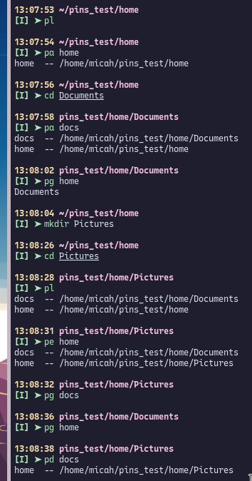
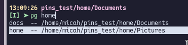

# pins

ohmyzsh plugin for pinning directories. Like a CLI folder bookmark manager (with tab completion!)

## Usage

| Command     | Description                                      |
| ----------- | ------------------------------------------------ |
| `pl`        | list all pins                                    |
| `pg <name>` | go to pin and list contents                      |
| `pa <name>` | add pin to current directory with name           |
| `pd <name>` | delete pin with name                             |
| `pe <name>` | edit pin with name to point to current directory |

## Demo

### Tab Completion

